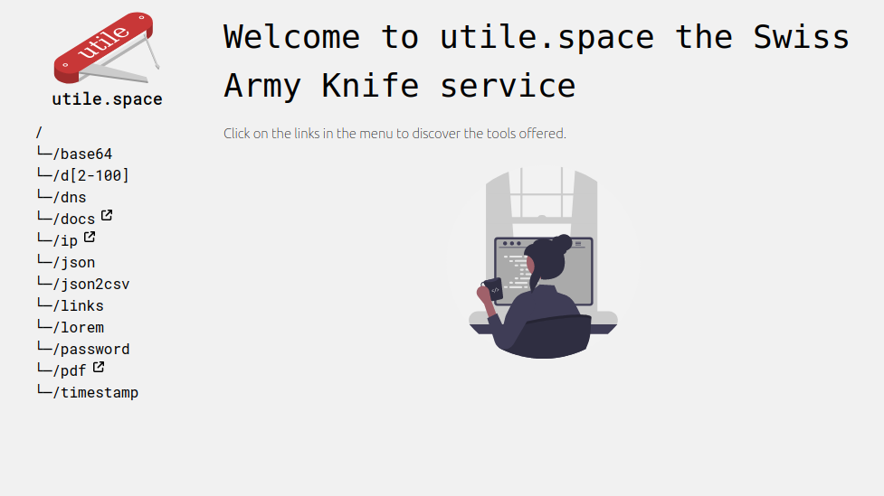

# https://utile.space

This repo is the collection of the subprojects and microservices running for the website https://utile.space.
The website is aimed to provide diverse services mostly aimed at software engineers. 

## Notes

The docker-compose allows you to run the entire website locally, and it's also used by the CI using Github Actions to deploy latest versions of the services. 

